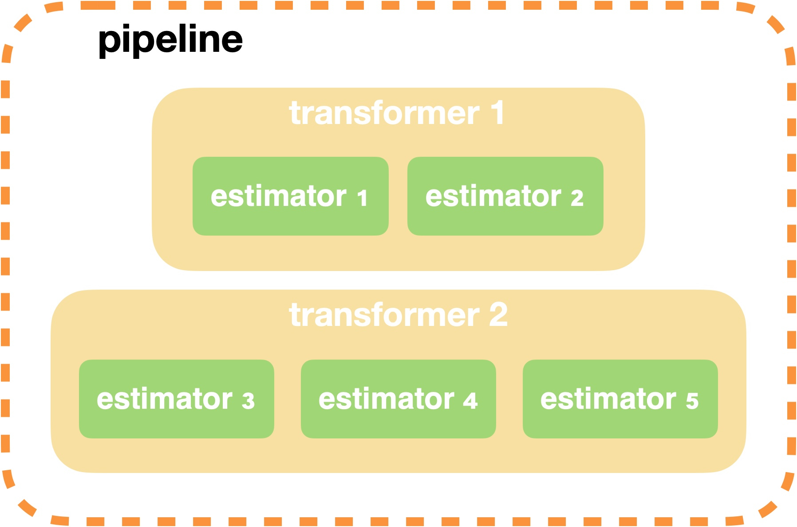
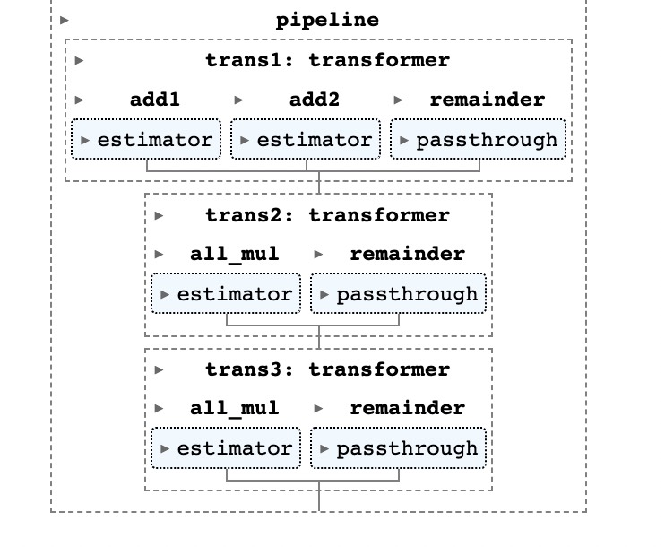
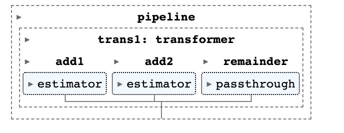

# Straw-Machine


A python making machine of sklearn pipeline. This python package tempt to lower the code level in constructing a complicated sklearn pipeline in actual data ETL or ML feature engineering. 





### Install

```shell
pip install straw_machine==0.0.1
```

### [Usage](example/example.ipynb)
```python
from straw_machine.util import (
    generate_estimator, 
    generate_transformer, 
    generate_pipeline
)

# udf function: add num to all df col 
def add(df, num:int, outcol:str):
    df[outcol] = df + num
    return df

# estimator: 
#   send ['a'] from dataframe to estimator inputs
#   estimator with function add num(1) to all inputs('a') and get outputs columns (['a', 'a+1'], if origin column is need)
estimator1 =generate_estimator(
    name='add1',
    func=add,
    inputs=['a'],
    outputs=['a','a+1'],
    kw_args={
        'num': 1,
        'outcol': 'a+1'
    }
)
estimator2 =generate_estimator(
    name='add2',
    func=add,
    inputs=['a'],
    outputs=['a+2'],
    kw_args={
        'num': 2,
        'outcol': 'a+2'
    }
)

# generate transformer with name specific and estimators list   
t1 = generate_transformer(
    name='trans1',
    estimators=[estimator1, estimator2]
)

pl = generate_pipeline(transformers=[t1])
```



### TODO

> 1. low code pipeline building
- [ ] with streamlit / gradio support